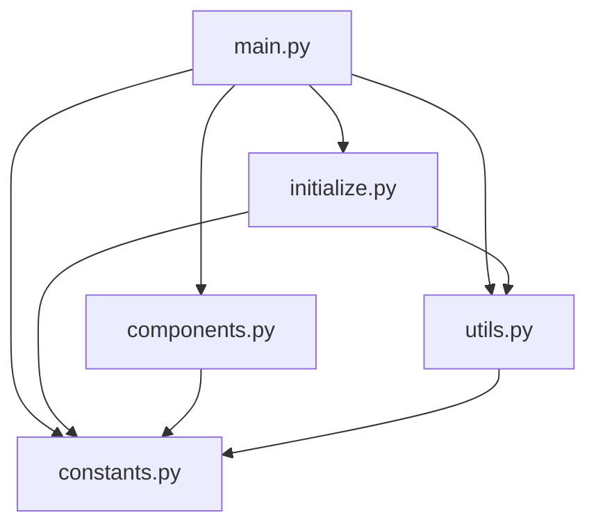

# AIエージェント向けドキュメント

このドキュメントは、対話型商品レコメンド生成AIアプリをメンテナンスするAIエージェント（Roocode）向けの情報を提供します。

## システム概要（AIエージェント向け）

このシステムは、ユーザーの自然言語入力に基づいて商品を推薦するStreamlitアプリケーションです。RAG（Retrieval-Augmented Generation）技術を使用して、ユーザーの要望に最も適した商品を検索し、その情報を表示します。

## コードベースの構造と依存関係



### 主要なモジュールと責任範囲

1. **main.py**: アプリケーションのエントリーポイント。Streamlitアプリの構造と処理フローを定義。
2. **initialize.py**: アプリケーションの初期化処理を担当。セッション状態、ログ出力、RAG Retrieverの設定。
3. **components.py**: UI表示に関する関数を定義。アプリタイトル、メッセージ、商品情報の表示。
4. **utils.py**: ユーティリティ関数を定義。エラーメッセージの構築、形態素解析。
5. **constants.py**: アプリケーション全体で使用される定数を定義。

## データフロー

1. ユーザーがチャット入力から商品の要望を入力
2. 入力テキストがRAGシステム（EnsembleRetriever）に送信される
3. EnsembleRetrieverが以下の2つの検索を実行
   - BM25Retriever: キーワードベースの検索
   - Chroma + OpenAI Embeddings: 意味ベースの検索
4. 検索結果から最適な商品が選択され、ユーザーに表示
5. 会話履歴がセッションに保存される

## コード解析（AIエージェント向け詳細情報）

### セッション状態の管理

Streamlitのセッション状態（`st.session_state`）を使用して、以下の情報を管理しています：

- `messages`: 会話履歴
- `retriever`: RAGのRetrieverオブジェクト
- `session_id`: セッションID（ログ出力用）
- `initialized`: 初期化フラグ

```python
# initialize.py内のコード
def initialize_session_state():
    """
    初期化データの用意
    """
    if "messages" not in st.session_state:
        st.session_state.messages = []
```

### RAGシステムの実装

RAGシステムは、BM25RetrieverとChroma+OpenAI Embeddingsを組み合わせたEnsembleRetrieverを使用しています：

```python
# initialize.py内のコード
embeddings = OpenAIEmbeddings()
db = Chroma.from_documents(docs, embedding=embeddings)
retriever = db.as_retriever(search_kwargs={"k": ct.TOP_K})

bm25_retriever = BM25Retriever.from_texts(
    docs_all,
    preprocess_func=utils.preprocess_func,
    k=ct.TOP_K
)
ensemble_retriever = EnsembleRetriever(
    retrievers=[bm25_retriever, retriever],
    weights=ct.RETRIEVER_WEIGHTS
)
```

### 日本語処理

日本語の形態素解析にはSudachiPyを使用しています：

```python
# utils.py内のコード
def preprocess_func(text):
    """
    形態素解析による日本語の単語分割
    """
    tokenizer_obj = dictionary.Dictionary(dict="full").create()
    mode = tokenizer.Tokenizer.SplitMode.A
    tokens = tokenizer_obj.tokenize(text ,mode)
    words = [token.surface() for token in tokens]
    words = list(set(words))
    
    return words
```

### Windows環境対応

Windows環境での文字化け対策として、Unicode正規化と文字コード変換を行っています：

```python
# initialize.py内のコード
def adjust_string(s):
    """
    Windows環境でRAGが正常動作するよう調整
    """
    # 調整対象は文字列のみ
    if type(s) is not str:
        return s

    # OSがWindowsの場合、Unicode正規化と、cp932（Windows用の文字コード）で表現できない文字を除去
    if sys.platform.startswith("win"):
        s = unicodedata.normalize('NFC', s)
        s = s.encode("cp932", "ignore").decode("cp932")
        return s
    
    # OSがWindows以外の場合はそのまま返す
    return s
```

## AIエージェントによるメンテナンス指針

### コード修正時の注意点

1. **セッション状態の維持**: Streamlitのセッション状態を変更する場合は、既存の会話履歴や状態が失われないように注意してください。

2. **エラーハンドリング**: 各処理ブロックでは適切なtry-except構文を使用し、エラーメッセージをログに出力してユーザーに表示してください。

3. **Windows/Mac互換性**: 文字コードやパス区切り文字など、OS間の違いに注意してください。特に日本語処理では、Windows環境での文字化けに注意が必要です。

4. **依存関係の管理**: requirements_windows.txtとrequirements_mac.txtの両方を更新してください。

### 機能拡張のためのガイドライン

1. **新しい商品データの追加**:
   - data/products.csvに新しい行を追加
   - 商品画像をimages/products/ディレクトリに追加

2. **UIコンポーネントの追加**:
   - components.pyに新しい表示関数を追加
   - main.pyから呼び出す

3. **検索アルゴリズムの改善**:
   - initialize.pyのinitialize_retriever関数を修正
   - 重み（ct.RETRIEVER_WEIGHTS）やトップK値（ct.TOP_K）の調整

4. **新しい定数の追加**:
   - constants.pyに新しい定数を追加
   - 適切なセクションにコメント付きで追加

### デバッグとトラブルシューティング

1. **ログの活用**: ログファイル（logs/application.log）を確認して、エラーの原因を特定してください。

2. **セッション状態の確認**: デバッグ時には`st.write(st.session_state)`を使用して、現在のセッション状態を確認できます。

3. **OpenAI API関連の問題**: APIキーの設定や利用制限を確認してください。

4. **Windows環境での文字化け**: adjust_string関数の動作を確認し、必要に応じて修正してください。

## コードベースの改善提案（AIエージェント向け）

1. **型ヒントの追加**: 関数の引数と戻り値に型ヒントを追加して、コードの可読性と保守性を向上させる。

2. **ドキュメンテーションの強化**: 各関数やクラスにより詳細なドキュメントを追加する。

3. **テストの追加**: 単体テストと統合テストを追加して、コードの品質を確保する。

4. **モジュール化の強化**: 機能ごとにモジュールを分割し、より明確な責任範囲を設定する。

5. **設定の外部化**: ハードコードされた設定値を設定ファイルに移動する。

6. **エラーハンドリングの強化**: より具体的なエラーメッセージとリカバリー手順を提供する。

7. **パフォーマンスの最適化**: 大量のデータを扱う場合のメモリ使用量とレスポンス時間を最適化する。

## システム拡張のためのアイデア（AIエージェント向け）

1. **マルチモーダル入力**: テキスト入力だけでなく、画像入力にも対応する。

2. **パーソナライゼーション**: ユーザーの過去の選択に基づいて推薦を調整する。

3. **商品比較機能**: 複数の商品を比較する機能を追加する。

4. **フィルタリングオプション**: カテゴリ、価格帯、評価などでフィルタリングする機能を追加する。

5. **APIエンドポイント**: 他のアプリケーションから利用できるAPIを提供する。

6. **多言語対応**: 日本語以外の言語にも対応する。

7. **データベース連携**: CSVファイルからデータベースへの移行。

## AIエージェントによるコード生成のためのテンプレート

### 新しいUIコンポーネントの追加

```python
def display_new_component(data):
    """
    新しいUIコンポーネントの表示
    
    Args:
        data: 表示するデータ
    """
    st.markdown("## 新しいコンポーネント")
    
    # データの表示
    st.write(data)
    
    # インタラクティブな要素
    if st.button("詳細を表示"):
        st.write("詳細情報")
```

### 新しいユーティリティ関数の追加

```python
def new_utility_function(input_data):
    """
    新しいユーティリティ関数
    
    Args:
        input_data: 入力データ
        
    Returns:
        処理結果
    """
    # 入力データの検証
    if not input_data:
        logger = logging.getLogger(ct.LOGGER_NAME)
        logger.warning("入力データが空です")
        return None
    
    # データ処理
    result = process_data(input_data)
    
    return result
```

### エラーハンドリングのテンプレート

```python
try:
    # 処理
    result = process_data(input_data)
except Exception as e:
    logger = logging.getLogger(ct.LOGGER_NAME)
    logger.error(f"{ct.ERROR_MESSAGE}\n{e}")
    st.error(utils.build_error_message(ct.ERROR_MESSAGE))
    st.stop()
```

## まとめ

このドキュメントでは、対話型商品レコメンド生成AIアプリのコードベースとアーキテクチャについて、AIエージェント（Roocode）向けに詳細な情報を提供しました。システムの理解、メンテナンス、拡張に役立ててください。